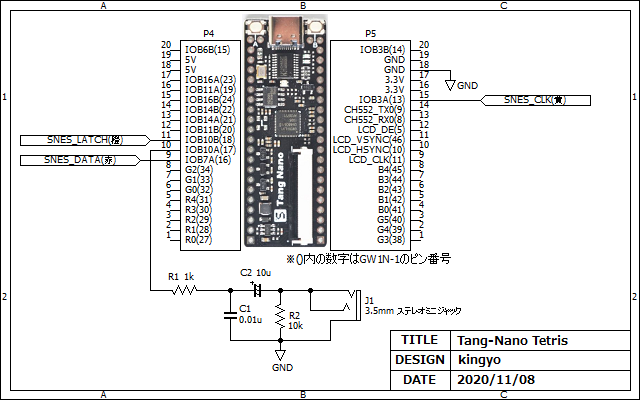
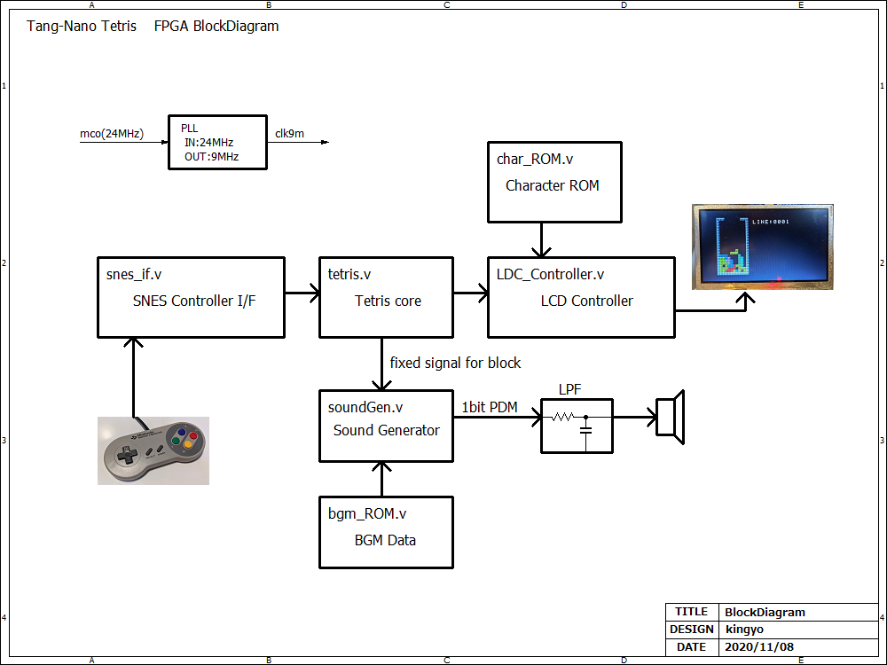
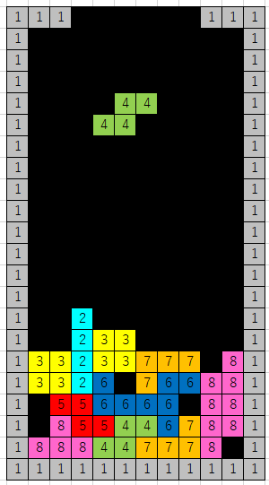
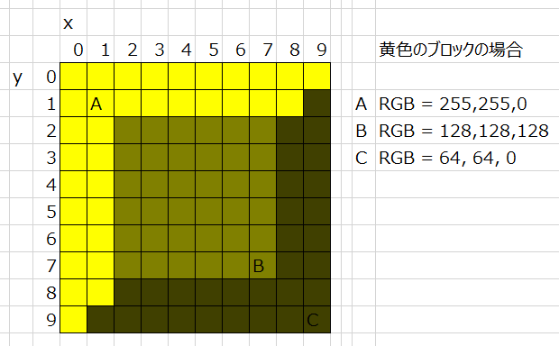
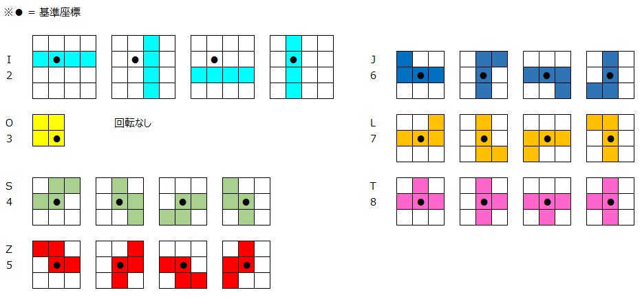

# Tang-Nano_Tetris
Tang-Nano FPGAボードで動作するテトリスゲームを実装してみました。SNESコントローラを接続してプレイすることができます。ソースコードは大変散らかっており、至るところにバグが潜んでいると思われますのでご注意ください（？）  
  

## ハードウェア
Tang-NanoにSNESコントローラと音声出力用のLPFを接続します。  

# FPGA内部ブロック図
超雑で申し訳ありません。肝心のtetris.vはソースコードを見たほうが早いです。  
（よくわからんが、まぁ動いている（稀にテトリミノが壁に刺さるバグあり）からヨシ！）  
  

## フィールド
フィールドサイズは外枠を含めて、横12 x 縦22ブロックとしました。Wikipediaに記載のある図が由来です。  
Tetris - Wikipedia https://en.wikipedia.org/wiki/Tetris  

## ブロック
ブロックのサイズは、10x10pixelとしました。内部処理では、ブロックに4bitのcodeを割り当てて管理しています。codeとテトリミノの種類、色の対応関係は次のとおりです。
| code(dec) | 割当 | 色 |
| ---- | ---- | ---- |
| 0    | 背景 | 黒 |
| 1    | 外枠ブロック | 灰 |
| 2    | テトリミノ(I) | 水 |
| 3    | テトリミノ(O) | 黄 |
| 4    | テトリミノ(S) | 緑 |
| 5    | テトリミノ(Z) | 赤 |
| 6    | テトリミノ(J) | 青 |
| 7    | テトリミノ(L) | 橙 |
| 8    | テトリミノ(T) | 桃 |
| その他 | 未使用 | - |

ブロックをLCDに描画する際には、ブロックの境界をクッキリさせ、立体感を出すために明暗を付けています。例えばテトリミノ(O)は黄色ですが、実際には以下の図のような配色で描画されています。    

## テトリミノ
tetris.vで定義されています。基準となるXY座標（r_block_pos_x, r_block_pos_y）からのオフセットとして定義しています。LCDのスキャン位置信号（i_pos_x, i_pos_y）とオフセットが一致している場合にブロックが描画されます。  

## フィールド情報の管理について
フィールドの情報（外枠や固定されたブロック）はDPRAMに格納しています。データ幅はブロックのコードを格納するために4bit確保しており、深さは12 x 22 = 264必要となります。  
以下、ポートの割当です。  
**ポートA：**
* クロック：9MHz
* アドレス制御：フィールド初期化時は初期化対象Writeアドレスがセットされる。ライン消去処理時はReadアドレスがセットされる。それ以外は、固定対象テトリミノのWriteアドレスがセットされる。
* Writeデータ：フィールド初期化データ、固定対象テトリミノデータ
* Readデータ：ライン消去処理で使用

**ポートB：**
* クロック：9MHz
* アドレス制御：ライン消去処理時は上書き対象アドレスがセットされる。それ以外はLCDの描画位置から算出されるVRAM Readアドレスがセットされる。
* Writeデータ：ライン消し処理時に1ライン上の情報が入力される
* Readデータ：LCDへの描画データ、当たり判定用

## サウンド処理
BGMとテトリミノ固定時の効果音を再生する機能を実装しました。  
BGMは2音（Chあたり1音 x 2ch）同時発音に対応しています。bgm_ROM.vにズラッと並んだデータがSMF(Standard MIDI File)から生成した譜面データです。最大で1024個のイベントを登録可能です。  
効果音は、32bitの線形帰還シフトレジスタで生成される信号を出力します。「ザッ、ザッ」というノイズ音です。  
BGMと効果音は加算され、最終的に8bit幅のデータとなります。これをΔΣ型のDACに入力し、1bitのPDM変調信号を得ます。外付けのLPFでアナログ信号に再生されます。  

## 操作方法
* 矢印キー左右：テトリミノを左右に移動
* 矢印キー下：テトリミノを下に移動
* Aボタン：テトリミノを右回転
* Bボタン：テトリミノを左回転
* SELECTボタン：フィールド内の固定されたテトリミノを全てクリア。LINEカウンタをリセットする。

## 開発環境
- IDE : GOWIN FPGA Designer Version1.9.2.02 Beta build(35976)

## Resource Usage Summary:
|  Resource  |  Usage |  Utilization  |
| ---------- | ------ | ------------- |
|  Logics  |  932/1152  | 80% |
|  --LUTs,ALUs,ROM16s  |  932(806 LUTs, 126 ALUs, 0 ROM16s)  | - |
|  --SSRAMs(RAM16s)  |  0  | - |
|  Registers  |  474/945  | 50% |
|  --logic Registers  |  460/864  | 53% |
|  --I/O Registers  |  14/81  | 17% |
|  BSRAMs  |  4/4  | 100% |

## 参考
- ExcelでMIDI http://otktake.blogspot.com/2015/01/excelmidi.html
- SMF(Standard MIDI File)フォーマット解説 http://maruyama.breadfish.jp/tech/smf/
